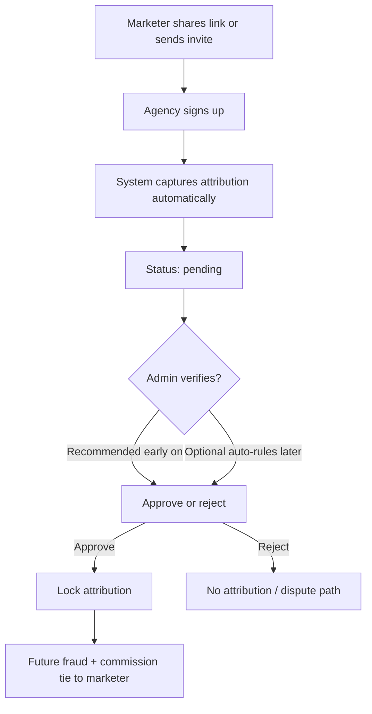

# Marketing Agents — Attribution Process Design

> **Source:** Marketing Agents Process Design spec, images 5–7.  
> **UI spec:** [marketing-dashboard.md](./marketing-dashboard.md) — portal sections, tables, and admin Control Tower.

## Overview

Referral programs fail when attribution is based on honor system claims. Property Eye’s marketing program requires **verifiable attribution mechanisms**, implemented as **layered methods** (not a single channel).

**Core rule:** Don’t overwrite old records — use versioning and audit logs when rules or attributions change.

---

## Why layered attribution?

| Problem | Solution |
|---------|----------|
| “I referred them” disputes | Automatic link + invite token capture |
| Offline / enterprise relationships | Invite system with locked token |
| Pre-existing agencies | Manual claim + admin approval only |
| Rule changes over time | Attribution versioning + locked records |

---

## Attribution methods

### Method 1: Unique referral links (primary)

**Mechanism**

- Each marketer gets a unique URL, e.g. `https://yourplatform.com/signup?ref=MARKETER123`
- On signup, system captures referral ID, stores on agency record, timestamps event

**Benefits**

- Automated, scalable, low friction, hard to dispute

**Development requirements**

| Layer | Requirement |
|-------|-------------|
| Frontend | Copy link UI; persist `ref` from query string through signup steps |
| Tracking | Cookie and/or `session_id` + backend persistence |
| Signup flow | Attribution logic runs on `signup_completed` |
| Backend | Referral code generation per marketer; idempotent assign |

**Signup flow changes (frontend)**

1. Landing or `/signup` reads `ref` query param  
2. Store in `sessionStorage` / cookie for multi-step auth (`AuthFlowLayout` routes)  
3. Include `referral_code` in agency registration payload  
4. Show user non-blocking copy: “Referred by partner program” (optional)

---

### Method 2: Agency invite system (high-trust)

**Mechanism**

1. Marketer enters agency name + contact email  
2. System sends invite email with **unique token** bound to marketer  
3. Agency signs up via invite link → attribution **locked** to that marketer

**Benefits**

- Removes ambiguity; strong for enterprise onboarding; prevents “who referred them?” disputes

**Development requirements**

| Layer | Requirement |
|-------|-------------|
| Frontend | `InviteAgencyModal` (name, email); invite status table |
| Backend | Token generation, email send, token validation on signup |
| Status | `sent` → `opened` → `signed_up` |

**Invite URL pattern (example)**

`https://yourplatform.com/signup?invite={token}`

---

### Method 3: Manual claim + approval (fallback)

**Mechanism**

- For agencies already in the system or brought in offline  
- Marketer submits **claim** with evidence (emails, contracts, screenshots)  
- Admin **approves or rejects** — never automatic

**Constraints**

- Must **never** auto-approve  
- Creates `source: manual`, `status: pending`  
- Evidence required in UI before submit enabled

**Frontend**

- `SubmitClaimModal` on My Agencies (see marketing dashboard doc)  
- Admin: `AttributionEvidenceModal` + approve/reject in Attribution Control queue

---

### Method 4: Attribution rules engine (critical)

Defines business rules so disputes are minimized.

| Rule | Options / notes |
|------|-----------------|
| Touch model | First-touch vs last-touch (product decision) |
| Lock period | e.g. 90 days from first touch |
| Exclusivity | One marketer per agency (or documented shared rules) |
| Immutability | No changes after `approved` + `locked_at` without admin override |
| Versioning | When rules change, new agencies use new version; old records keep prior version |

**Admin UI (Phase 2+)**

- Settings panel under Commission Engine or Attribution Control  
- Display active rule version + effective date  

---

## Data model (entities & fields)

### Marketer

```typescript
interface Marketer {
  id: string;
  name: string;
  email: string;
  referral_code: string; // e.g. MARKETER123
  commission_percent: number;
  status: "active" | "inactive";
  created_at: string;
}
```

### Agency (marketing-related fields)

Extend existing agency model:

```typescript
interface AgencyMarketingFields {
  attributed_marketer_id?: string;
  attribution_source?: "link" | "invite" | "manual";
  attribution_status?: "pending" | "approved" | "rejected";
  attribution_locked_at?: string;
}
```

### Attribution record

```typescript
interface Attribution {
  id: string;
  agency_id: string;
  marketer_id: string;
  source: "link" | "invite" | "manual";
  status: "pending" | "approved" | "rejected";
  created_at: string;
  locked_at?: string;
  approved_by?: string;
  evidence_urls?: string[]; // manual claims
  rule_version?: number;
}
```

### Invite

```typescript
interface AgencyInvite {
  id: string;
  marketer_id: string;
  agency_name: string;
  agency_email: string;
  token: string;
  status: "sent" | "opened" | "signed_up";
  created_at: string;
  opened_at?: string;
  signed_up_at?: string;
}
```

### Referral tracking (click / session)

```typescript
interface ReferralTracking {
  referral_code: string;
  session_id: string; // or cookie_id
  timestamp: string;
  event?: "referral_clicked";
}
```

---

## Attribution flow (clean version)



**Steps**

1. Marketer shares link **or** sends invite  
2. Agency signs up  
3. System captures attribution automatically  
4. Attribution → **`pending`**  
5. Admin verifies (optional early on; recommended in MVP)  
6. Attribution → **`locked`** (`locked_at` set)  
7. All future fraud cases and commission lines reference that marketer  

---

## Anti-gaming & fraud prevention

| Control | Implementation |
|---------|----------------|
| Self-referral detection | Same email domain, same IP/device patterns, suspicious flags |
| Attribution locking | No free edits after lock; override requires admin + audit |
| Duplicate agency detection | Same domain, company registration, fuzzy name match → warning in admin Agency Management |
| Audit logs | Who created, approved, changed attribution |

**Admin UI signals**

- `AttributionConflictAlert` when two marketers claim same agency  
- `DuplicateAgencyWarning` on agency profile  
- Block approve if self-referral flag is set (unless override with reason)

---

## Scalability & event-driven tracking

Prefer **events** (not only DB writes) for debugging and analytics:

| Event | When |
|-------|------|
| `referral_clicked` | User lands with `?ref=` |
| `invite_sent` | Marketer submits invite form |
| `invite_opened` | Email link opened |
| `signup_completed` | Agency finishes registration |
| `attribution_assigned` | Record created (pending) |
| `attribution_approved` | Admin approves |
| `attribution_locked` | Lock timestamp set |

**Idempotent attribution logic**

- Duplicate clicks or double signup must **not** create multiple attribution rows  
- Use unique constraint on `(agency_id)` or `(agency_id, marketer_id)` per exclusivity rule  

**Attribution versioning**

- If commission % or touch model changes, store `rule_version` on new attributions  
- **Don’t overwrite** historical records — append version history table  

---

## UX requirements (where most systems fail)

### For marketers

| Element | Location |
|---------|----------|
| “Your referral link” | Referrals section / overview |
| “Invite agency” button | Referrals section |
| Pending attributions | My Agencies filter `status=pending` |
| Approved agencies | My Agencies filter `status=active` |
| Clear status labels | Every table row and detail view |

### For admin

| Element | Location |
|---------|----------|
| Attribution review queue | `/admin/marketing/attributions` |
| Evidence view | Modal on manual claims |
| Approve / reject controls | Queue row actions |
| Conflict alerts | Banner + nav badge when conflicts exist |

---

## Implementation recommendation

### STEP 1 — Core stack (build first)

- [ ] Referral links (`?ref=` through signup)  
- [ ] Invite system (form + status table + token signup)  
- [ ] Admin approval workflow (pending → approved/rejected)  
- [ ] Attribution locking (`locked_at`, immutable UI)  
- [ ] Basic fraud checks (self-referral, duplicate warnings)  
- [ ] Audit log entries on approve/reject/override  

### STEP 2 — Advanced

- [ ] Automated validation rules (reduce manual review)  
- [ ] Dispute workflows (link to dashboard Section 6 / admin Section 8)  
- [ ] Analytics (referral funnel, conversion by marketer)  
- [ ] Multi-touch attribution (only if product requires)  

---

## Frontend implementation plan (attribution-specific)

### Mock data (`src/data/marketing/`)

| File | Contents |
|------|----------|
| `marketer-profile-data.ts` | `referral_code`, link URL |
| `invites-data.ts` | Invite list with statuses |
| `attributions-data.ts` | Pending/approved/rejected rows |
| `attribution-conflicts-data.ts` | Two marketers, one agency |

### Hooks / utilities (`src/lib/marketing/`)

| Utility | Purpose |
|---------|---------|
| `captureReferralCode()` | Read `ref` from URL on mount |
| `getStoredReferralCode()` | Read from session for signup payload |
| `buildReferralUrl(code)` | `origin/signup?ref={code}` |

### Auth flow integration

Files to touch when API ready:

- `src/pages/auth/Signup.tsx`  
- `src/pages/auth/AgencyInformation.tsx`  
- `src/App.tsx` — optional redirect preserving query string  

### Admin components (priority)

1. `AttributionQueueTable` — pending manual + conflict rows  
2. `AttributionEvidenceModal` — evidence list + notes  
3. `AttributionApproveRejectActions` — with confirm + audit reason on override  

### Signup integration checklist

- [ ] `?ref=` captured on first visit, survives `AuthFlowLayout` steps  
- [ ] `?invite=` token validated; pre-fill email if available  
- [ ] Payload includes `referral_code` or `invite_token` on agency create  
- [ ] Idempotent: second submit doesn’t duplicate attribution (backend; frontend disable submit)  

---

## Relationship to commission & fraud

Once attribution is **locked**:

- Fraud cases on that agency surface in marketer **Fraud Cases** table  
- Commission engine uses marketer `commission_percent` + rule conditions (e.g. only after `recovered`)  
- Approval queue creates line items tied to `(marketer_id, agency_id, case_id)`  

See [marketing-dashboard.md](./marketing-dashboard.md) — Commission Engine, Approval Queue, Fraud Case Management.

---

## Testing checklist

**Referral link**

- [ ] Visit `/signup?ref=TEST123` → code stored through OTP and agency steps  
- [ ] Signup without ref → no attribution row  
- [ ] Duplicate signup → single attribution (idempotent)

**Invite**

- [ ] Send invite → row `sent`  
- [ ] Open link → `opened`  
- [ ] Complete signup → `signed_up` + pending/locked attribution  

**Manual claim**

- [ ] Submit claim → pending only  
- [ ] Admin reject → marketer sees `rejected`  
- [ ] Admin approve → lock; second marketer claim shows conflict  

**Locking**

- [ ] Locked attribution cannot be edited without override modal + audit reason  

---

## Open questions

- [ ] First-touch vs last-touch default?  
- [ ] Auto-approve link/invite attributions after launch, or always manual for N months?  
- [ ] Shared attribution allowed for enterprise partners?  
- [ ] Cookie TTL for `ref` persistence (align with lock period)?  

---

*Last updated: June 4, 2026*
